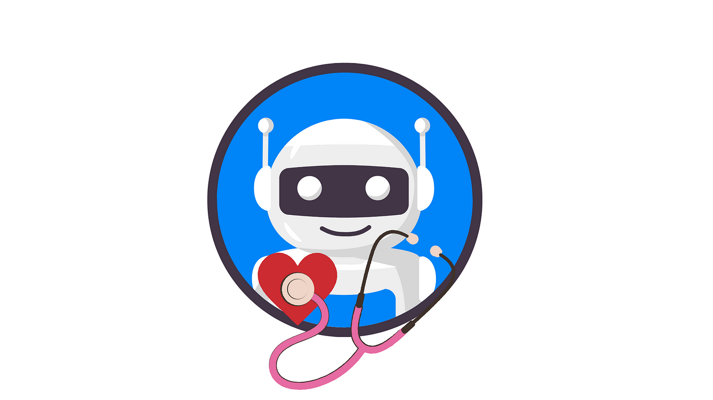

# 🩺 MedHelp — AI-Powered Medical Chatbot

<p align="center">
  
</p>

<p align="center">
  <strong>An AI-powered medical question-answering chatbot built with Llama 2, LangChain, Pinecone, and Flask.</strong>
</p>

<p align="center">
  
  
  
  
  
</p>

---

## 📌 Overview

**MedHelp** is a research/educational medical question-answering chatbot that combines a large language model with retrieval-based information access.

The project uses **Llama 2**, **LangChain**, **Pinecone**, and **Flask** to demonstrate how an AI-powered conversational application can retrieve relevant information and generate natural-language responses.

> ⚠️ **Medical disclaimer:** MedHelp is an educational/research project. It is not a medical device and should not be used for diagnosis, treatment decisions, or emergencies. Always consult a qualified healthcare professional for medical advice.

---

## ✨ Key Features

- 🤖 AI-powered conversational question answering
- 🧠 Llama 2 language model integration
- 🔎 Retrieval-based medical information workflow
- 🗂️ Pinecone vector database integration
- 🔗 LangChain orchestration
- 🌐 Flask web application
- 💬 Browser-based chat interface
- 🐍 Python-based implementation
- 📚 Medical knowledge-source integration

---

## 🏗️ High-Level Architecture

```text
┌──────────────────────┐
│        User          │
│   Medical Question   │
└──────────┬───────────┘
           │
           ▼
┌──────────────────────┐
│     Flask Web App    │
│    Chat Interface    │
└──────────┬───────────┘
           │
           ▼
┌──────────────────────┐
│   Query Processing   │
│     + LangChain      │
└──────────┬───────────┘
           │
           ▼
┌──────────────────────┐
│  Pinecone Vector DB  │
│ Medical Knowledge    │
└──────────┬───────────┘
           │
     Relevant Context
           │
           ▼
┌──────────────────────┐
│      Llama 2         │
│   Response Generation│
└──────────┬───────────┘
           │
           ▼
┌──────────────────────┐
│   Chat Response      │
└──────────────────────┘
```

---

## 🛠️ Technology Stack

| Technology | Role |
|---|---|
| **Python** | Application development |
| **Llama 2** | Large language model |
| **LangChain** | LLM/retrieval workflow |
| **Pinecone** | Vector database |
| **Flask** | Web application |
| **HTML/CSS** | Chat interface |
| **Jupyter Notebook** | Experimentation |

---

## 📂 Repository Structure

```text
Med_Help_Chatbot/
│
├── data/                  # Medical knowledge/data files
├── model/                 # Local model files
│
├── app.py                 # Flask application entry point
├── helper.py              # Supporting application utilities
├── prompt.py              # Prompt configuration
├── store_index.py         # Vector-index creation workflow
├── template.py            # Application/template configuration
│
├── chat.html              # Chat interface
├── style.css              # Frontend styling
├── medhelp_logo.png       # Project logo
│
├── requirements.txt       # Python dependencies
├── setup.py               # Project setup configuration
├── trials.ipynb           # Development/experimentation notebook
│
├── docs/
│   ├── ARCHITECTURE.md
│   └── PROJECT_OVERVIEW.md
│
├── .github/
│   └── ISSUE_TEMPLATE/
│
├── .gitignore
├── SECURITY.md
├── CONTRIBUTING.md
└── README.md
```

---

## ⚙️ Local Setup

### 1. Clone the repository

```bash
git clone https://github.com/sifat2200/Med_Help_Chatbot.git
cd Med_Help_Chatbot
```

### 2. Create the Conda environment

The original project setup uses Python 3.11:

```bash
conda create -n medhelp python=3.11 -y
conda activate medhelp
```

### 3. Install dependencies

```bash
pip install -r requirements.txt
```

### 4. Configure environment variables

Create a `.env` file in the project root:

```env
PINECONE_API_KEY=your_pinecone_api_key
PINECONE_API_ENV=your_pinecone_environment
```

Never commit `.env` or real API credentials.

### 5. Prepare the model and knowledge source

The original project instructions require the Llama 2 model to be placed in the `model/` directory and the required medical knowledge source to be placed in `data/`.

Do not commit large model binaries, private datasets, credentials, or copyrighted material unless you have the right to redistribute them.

### 6. Build the vector index

```bash
python store_index.py
```

### 7. Start the Flask application

```bash
python app.py
```

Then open:

```text
http://127.0.0.1:5000
```

---

## 🔐 Environment & Security

Required environment variables:

```text
PINECONE_API_KEY
PINECONE_API_ENV
```

Keep credentials outside source control.

Recommended local files:

```text
.env
.env.*
```

These are ignored by the included `.gitignore`.

If an API key has ever been committed publicly, rotate/revoke it before continuing development.

---

## 🧪 Development Notebook

`trials.ipynb` contains project experimentation/development work.

For a portfolio repository, keep the notebook only if it adds useful reproducible context. Otherwise, move exploratory notebooks into a clearly named `notebooks/` directory.

---

## 📸 Demo

For a stronger portfolio presentation, add a real screenshot of the running chatbot:

```text
assets/chatbot-demo.png
```

Then add:

```markdown
## 🖥️ Application Preview

<p align="center">
  
</p>
```

Do not use a mock screenshot that does not represent the actual application.

---

## 🎯 Learning & Project Focus

This project demonstrates practical work with:

- Natural Language Processing
- Large Language Models
- Retrieval-based question answering
- Vector databases
- Prompt engineering
- Python web applications
- AI-assisted healthcare information systems

---

## ⚠️ Limitations

This project should not be presented as a clinically validated diagnostic or treatment system.

Potential limitations include:

- Generated responses may contain errors.
- Retrieved information may be incomplete.
- The model may misunderstand a user's question.
- The project has not been established as a clinical decision-support system.
- Real-world deployment would require substantially stronger validation, safety controls, monitoring, privacy protections, and expert review.

---

## 🚀 Future Improvements

- [ ] Add response/source citations
- [ ] Improve retrieval quality
- [ ] Add automated evaluation
- [ ] Add conversation memory
- [ ] Add stronger prompt/safety controls
- [ ] Add unit and integration tests
- [ ] Improve frontend UX
- [ ] Add logging and monitoring
- [ ] Containerize with Docker
- [ ] Add deployment documentation
- [ ] Evaluate with a carefully designed medical QA benchmark

---

## 👨‍💻 Author

**Md. Shefatullah Bin Sadik**

Computer Science & Engineering Undergraduate  
North South University, Bangladesh

- GitHub: https://github.com/sifat2200
- LinkedIn: https://www.linkedin.com/in/md-shefatullah-bin-sadik-6711ba274

---

## 🤝 Contributors

This repository was developed collaboratively. Keep contributor names/links in this section accurate to the current project team.

---

## 📄 License

See the repository's existing `LICENSE` file for licensing terms.
